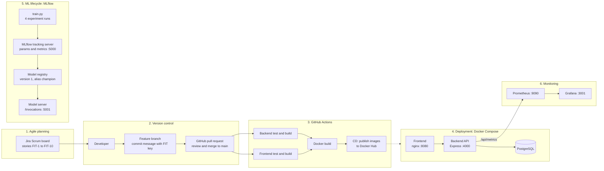

# FitTrack — DevOps Mini Project

A small personalized fitness/wellness web application built to demonstrate the complete DevOps flow required by the college mini-project.

## Features
- Register/login with JWT authentication
- User profile: age, gender, height, weight, target weight, activity level
- Goals: weight loss, weight gain, maintain, muscle building
- BMI, BMR, TDEE, calorie and macro calculations
- 7-day workout plan (no interactive timer/session system)
- 4-meal diet plan
- Water, sleep and weight tracking
- Simple reminders
- Dashboard
- Prometheus metrics and Grafana dashboard

## Technology stack
React + TypeScript + Vite + Tailwind CSS + Recharts charts; Node.js + Express + TypeScript + Prisma; PostgreSQL; GitHub Actions; Docker Compose; Prometheus; Grafana.

## Run the complete project
Requirements: Docker Desktop.

```bash
cp .env.example .env     # then edit .env and set your own passwords
docker compose up --build
```

Open:
- App: http://localhost:8080
- API: http://localhost:4000/health
- Prometheus: http://localhost:9090
- Grafana: http://localhost:3001 (user `admin`, password = `GRAFANA_ADMIN_PASSWORD` from your `.env`)

Demo account after running the seed locally is `demo@fittrack.local` / `demo12345`. For the Docker-only demo, register a new account from the UI.

## Local development
1. Start PostgreSQL: `docker compose up db -d`
2. Backend: `cd backend`, copy `.env.example` to `.env`, then `npm install`, `npx prisma migrate deploy`, `npm run dev`.
3. Frontend: `cd frontend`, `npm install`, `npm run dev`.

## DevOps pipeline
Develop → Git/GitHub → GitHub Actions → install/test/build → Docker image build → Docker Compose deployment → Prometheus → Grafana.

The CI workflow is `.github/workflows/ci.yml`. It runs backend migration/tests/build, frontend build, and builds the Docker images with Docker Compose.

## Architecture
```text
Browser :8080
    |
  Nginx /api proxy
    |
Express API :4000 ---- PostgreSQL :5433
    |
 /api/metrics
    v
Prometheus :9090 --> Grafana :3001
```

## Suggested meaningful commits
1. `feat: add backend auth and profile API`
2. `feat: add fitness plan generation and tracking`
3. `feat: add React dashboard and plan pages`
4. `ci: add GitHub Actions pipeline`
5. `devops: add Docker Compose Prometheus and Grafana`
6. `docs: add project report and run instructions`

## College demo checklist
- Show GitHub repository and commit history.
- Show successful GitHub Actions run.
- Run `docker compose up --build`.
- Register/login and complete profile.
- Generate a plan and show dashboard, diet, workout and tracking.
- Open Prometheus and show `/api/metrics` scrape.
- Open Grafana and show the FitTrack API dashboard.

## End-to-end DevOps workflow



1. Work is planned as Jira stories (project key `FIT`) in a two-week sprint.
2. Each story is built on its own Git branch; the pull request title starts with the Jira key (for example `FIT-9`).
3. On every push, GitHub Actions tests and builds the backend and frontend, builds the Docker images, and publishes them to Docker Hub from `main`.
4. The application runs with Docker Compose: frontend, backend and PostgreSQL.
5. The calorie-estimation model is trained and tracked with MLflow, registered as a versioned model, and served as a REST API.
6. Prometheus scrapes the backend's `/api/metrics` endpoint and Grafana shows the dashboard.

## ML lifecycle (MLflow)

The model estimates daily calories from age, gender, height, weight and activity level. There is no public dataset for this, so the training data is generated from the same Mifflin-St Jeor formula the app uses, plus random noise. The results are estimates.

```bash
docker compose -f docker-compose.ml.yml up -d --build mlflow     # tracking server, http://localhost:5000
python3 -m venv ~/fittrack-ml-venv && source ~/fittrack-ml-venv/bin/activate
pip install -r ml/requirements.txt "sqlalchemy>=2.0,<2.1"
MLFLOW_TRACKING_URI=http://localhost:5000 python ml/train.py     # 4 runs, registers version 1, alias champion
docker compose -f docker-compose.ml.yml --profile serve up -d model   # model API, http://localhost:5001
curl -s -X POST localhost:5001/invocations -H "Content-Type: application/json" \
  -d '{"dataframe_split":{"columns":["age","gender_male","height_cm","weight_kg","activity_factor"],"data":[[28,1,178,76.7,1.375]]}}'
```

## Known limitations

- The served model runs as a separate service; the FitTrack backend does not call it yet.
- Reminders are stored and shown in the app only; there are no push or e-mail notifications.
- The model is trained on generated data, so it only reproduces the formula it was built from.
