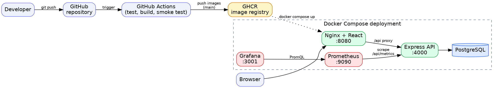

**Group members:** [Name 1 – Roll No.], [Name 2 – Roll No.], [Name 3 – Roll No.]
**Batch:** [Batch]  **GitHub repository:** [URL]  **Date:** [Date]

# 1. Problem Statement and Objectives

People who want to improve their fitness often keep profile data, targets and daily habits in different places. FitTrack is a small web application that calculates BMI, BMR and calorie/macro targets from a user's profile, generates a weekly workout plan and a daily diet plan, and tracks water, sleep and weight.

The objective of the project is to build this application and deliver it through a complete DevOps pipeline: version control, automated build and test, containerization, deployment and monitoring.

**Objectives**

- Develop a working web application (React frontend, Express API, PostgreSQL database).
- Manage source code in Git/GitHub using branches, pull requests and meaningful commits.
- Automate build, test and image creation with GitHub Actions.
- Containerize every component with Docker and deploy the stack with Docker Compose.
- Monitor the running application with Prometheus and Grafana.

# 2. Application Requirements and System Description

**Functional requirements:** user registration and login; profile and goal management; BMI/BMR/TDEE and macro calculation; 7-day workout plan; 4-meal diet plan; water, sleep and weight logging; reminders; dashboard.

**Non-functional requirements:** passwords stored hashed; protected API routes; input validation; health endpoint; observable through metrics; reproducible deployment with one command.

**System description:** The browser loads a React single-page application served by Nginx. Nginx forwards `/api` requests to the Express API. The API validates input with Zod, accesses PostgreSQL through Prisma and exposes Prometheus metrics at `/api/metrics`. Prometheus scrapes the API every 10 seconds and Grafana visualises the data.

# 3. Technology Stack and DevOps Tools

| Area | Tools |
|---|---|
| Frontend | React 18, TypeScript, Vite, Tailwind CSS, Recharts |
| Backend | Node.js 20, Express, TypeScript, Prisma ORM, Zod, JWT, bcrypt |
| Database | PostgreSQL 16 |
| Testing | Vitest, Supertest, React Testing Library |
| Version control | Git, GitHub |
| CI/CD | GitHub Actions, GitHub Container Registry |
| Containerization | Docker (multi-stage builds), Docker Compose |
| Monitoring | Prometheus, Grafana (provisioned dashboard), prom-client |

# 4. System / DevOps Architecture

{width=6.3in}

# 5. Git and GitHub Implementation

One repository holds the frontend, backend, Docker files, CI workflow, monitoring configuration and documentation. Work was done on feature branches (`feature/backend-api`, `feature/frontend-ui`, `feature/devops`) and merged into `main` through pull requests with review by another member. Commit messages follow the Conventional Commits style (`feat:`, `test:`, `build:`, `ci:`, `docs:`). No secrets are committed; `.env` is git-ignored and `.env.example` documents the variables.

| Member | Contribution |
|---|---|
| [Name 1] | [e.g. Backend API, database schema, tests] |
| [Name 2] | [e.g. Frontend pages, frontend tests] |
| [Name 3] | [e.g. Dockerfiles, CI workflow, Prometheus/Grafana, documentation] |

*Screenshot: commit history, branches and a merged pull request.*

# 6. CI Pipeline Design and Configuration

The workflow `.github/workflows/ci.yml` runs on every push and pull request and has four jobs:

1. **backend** – starts a PostgreSQL service container, installs dependencies, generates the Prisma client, applies migrations, runs unit and integration tests with coverage, compiles TypeScript, uploads the JUnit and coverage reports as artifacts.
2. **frontend** – runs the component and client tests, type-checks and builds the production bundle.
3. **docker** (needs 1 and 2) – builds both Docker images, starts the full Compose stack and smoke-tests it: health endpoint, user registration through the Nginx proxy, web UI delivery, Prometheus target status and Grafana dashboard provisioning.
4. **publish** (only on `main`) – tags and pushes the images to `ghcr.io` using the built-in `GITHUB_TOKEN`.

*Screenshot: green workflow run with all jobs; expanded test step.*

# 7. Build and Testing Process with Results

| Level | File | What is verified |
|---|---|---|
| Unit | `backend/tests/fitness.test.ts` | BMI, BMR (male/female), calorie deficit/surplus, 1200 kcal floor, difficulty mapping |
| Unit | `backend/tests/plans.test.ts` | 7-day workout plan, difficulty scaling, 4 meals summing to target calories |
| Integration | `backend/tests/api.test.ts` | health check, metrics endpoint, registration (201/400/409), login (200/401), auth guard (401), profile validation, plan generation and replacement, weight/water/sleep upserts, reminders CRUD, dashboard aggregation |
| Frontend | `frontend/src/__tests__/*.test.*` | API client (token, errors, 204), login/register forms, error display, protected-route redirect |

**Results:** [paste the `npm test` summary, e.g. "Tests 40 passed (40)"] and coverage table.

*Screenshot: terminal test output and the GitHub Actions test step.*

# 8. Dockerfile and Containerization Process

- **Backend image** – multi-stage build on `node:20-bookworm-slim`: the first stage installs dependencies, generates the Prisma client and compiles TypeScript; the runtime stage installs production dependencies only, runs as the non-root `node` user, defines a `HEALTHCHECK` and applies pending migrations (`prisma migrate deploy`) before starting the server.
- **Frontend image** – multi-stage build: Vite builds static files which are served by `nginx:alpine`; Nginx also proxies `/api` to the backend and blocks public access to `/api/metrics`.
- **Compose** – `docker-compose.yml` starts `db`, `backend`, `frontend`, `prometheus` and `grafana` with health-based start order and named volumes for data.

```
docker compose build
docker images | grep fittrack
docker compose up -d
```

*Screenshots: image list, `docker compose ps`, the running application.*

# 9. Deployment Process and Environment Details

**Environment:** local Docker Desktop (Docker Engine + Compose v2). Single command: `docker compose up --build -d`.

| Component | Port | Purpose |
|---|---|---|
| Frontend (Nginx) | 8080 | web UI and API proxy |
| Backend (Express) | 4000 | REST API, `/health`, `/api/metrics` |
| PostgreSQL | 5433 (host) → 5432 | database |
| Prometheus | 9090 | metrics storage and alert rules |
| Grafana | 3001 | dashboards |

The same images are published to GitHub Container Registry by the pipeline and can be pulled on any server with Docker.

*Screenshots: application pages and the `/health` response.*

# 10. Monitoring Setup (Prometheus and Grafana)

The API exposes default Node.js process metrics plus custom metrics: `fittrack_http_requests_total` (method, route, status), `fittrack_http_request_duration_seconds` (histogram), `fittrack_users_registered_total`, `fittrack_login_attempts_total` and `fittrack_plans_generated_total`. Route labels use the matched route pattern to keep cardinality low.

Prometheus scrapes `backend:4000/api/metrics` and evaluates three alert rules (`BackendDown`, `HighErrorRate`, `SlowRequests`). Grafana is provisioned automatically with a Prometheus data source and the **FitTrack API** dashboard (12 panels): backend status, total requests, users registered, plans generated, error ratio, request rate by route, requests by status code, latency p50/p95/p99, login success/failure, memory, CPU and event-loop lag.

*Screenshots: Prometheus targets page (UP), a PromQL query, the Grafana dashboard with live traffic.*

# 11. Screenshots / Evidence

[Insert the screenshots listed in `docs/GUIDE.md`, section 4, each with a one-line caption.]

# 12. Conclusion

The project delivers a working application and a repeatable pipeline: every push is built and tested automatically, the application and its monitoring stack start with one command, and the running system is observable through metrics and dashboards. Possible future work: Kubernetes manifests, automatic deployment to a cloud VM, Alertmanager notifications and end-to-end browser tests.
